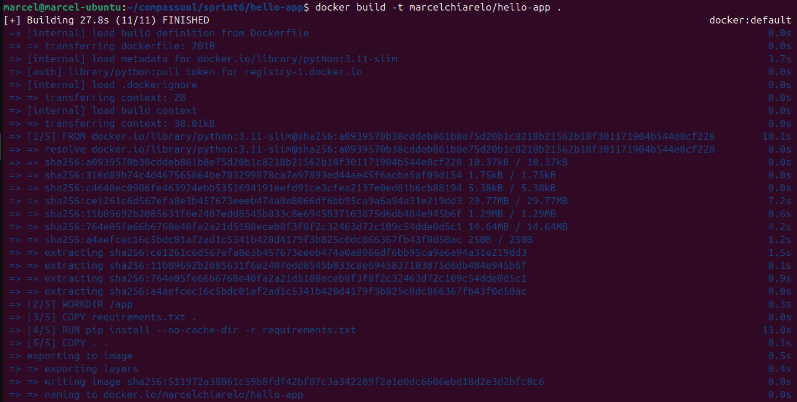
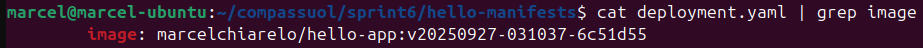
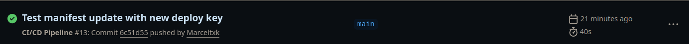
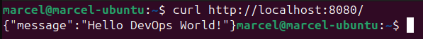

# Projeto CI/CD com GitHub Actions e ArgoCD


- **Objetivo**: Automatizar o ciclo completo de desenvolvimento, build, deploy e execução de uma aplicação FastAPI usando GitHub Actions para CI/CD, Docker Hub como registry, e ArgoCD para entrega contínua em Kubernetes local com Rancher Desktop.

## Pré-requisitos Atendidos
- Conta no GitHub (repo público)
- Conta no Docker Hub com token de acesso
- Rancher Desktop com Kubernetes habilitado
- kubectl configurado corretamente
- ArgoCD instalado no cluster local
- Git, Python 3 e Docker instalados

---

## Etapa 1: Criar a Aplicação FastAPI

### 1.1 Repositório da Aplicação
Criado repositório: `hello-app`

### 1.2 Estrutura de Arquivos Criados

#### main.py
```python
from fastapi import FastAPI
import uvicorn

app = FastAPI()

@app.get("/")
async def root():
    return {"message": "Hello World"}

if __name__ == "__main__":
    uvicorn.run(app, host="0.0.0.0", port=8000)
```

#### requirements.txt
```txt
fastapi==0.104.1
uvicorn[standard]==0.24.0
```

#### Dockerfile
```dockerfile
FROM python:3.11-slim

WORKDIR /app

COPY requirements.txt .
RUN pip install --no-cache-dir -r requirements.txt

COPY . .

EXPOSE 8000

CMD ["python", "main.py"]
```

### 1.3 Comandos para Upload Inicial
```bash
git add .
git commit -m "Initial commit for hello-app application"
git push origin main
```

## Etapa 2: Criar o GitHub Actions (CI/CD)

### 2.1 Estrutura do Workflow
Criado arquivo: `.github/workflows/ci-cd.yml`

```yaml
name: CI/CD Pipeline

on:
  push:
    branches: [ main ]

env:
  DOCKER_IMAGE: marcelchiarelo/hello-app

jobs:
  build-and-push:
    runs-on: ubuntu-latest
    
    steps:
    - name: Checkout code
      uses: actions/checkout@v4
      
    - name: Set up Docker Buildx
      uses: docker/setup-buildx-action@v3
      
    - name: Login to Docker Hub
      uses: docker/login-action@v3
      with:
        username: ${{ secrets.DOCKER_USERNAME }}
        password: ${{ secrets.DOCKER_PASSWORD }}
        
    - name: Generate image tag
      id: tag
      run: echo "IMAGE_TAG=v$(date +%Y%m%d-%H%M%S)-${GITHUB_SHA:0:7}" >> $GITHUB_OUTPUT
        
    - name: Build and push Docker image
      uses: docker/build-push-action@v5
      with:
        context: .
        push: true
        tags: |
          ${{ env.DOCKER_IMAGE }}:${{ steps.tag.outputs.IMAGE_TAG }}
          ${{ env.DOCKER_IMAGE }}:latest
          
    - name: Update manifest repository
      if: github.ref == 'refs/heads/main'
      run: |
        # Configurar SSH com debug
        mkdir -p ~/.ssh
        echo "${{ secrets.SSH_PRIVATE_KEY }}" > ~/.ssh/id_rsa
        chmod 600 ~/.ssh/id_rsa
        
        # Debug da chave
        echo "SSH key fingerprint:"
        ssh-keygen -lf ~/.ssh/id_rsa
        
        # Configurar known_hosts
        ssh-keyscan -H github.com >> ~/.ssh/known_hosts
        
        # Testar conexão SSH
        echo "Testing SSH connection:"
        ssh -T git@github.com || true
        
        # Configurar Git
        git config --global user.name "GitHub Actions"
        git config --global user.email "actions@github.com"
        
        # Clonar repositório
        git clone git@github.com:Marceltxk/hello-manifests.git temp-manifests
        cd temp-manifests
        
        # Verificar branch
        git branch -a
        
        # Atualizar imagem no deployment
        sed -i "s|image: ${{ env.DOCKER_IMAGE }}:.*|image: ${{ env.DOCKER_IMAGE }}:${{ steps.tag.outputs.IMAGE_TAG }}|g" deployment.yaml
        
        # Mostrar diferenças
        git diff
        
        # Commit e push
        git add deployment.yaml
        git commit -m "Update image tag to ${{ steps.tag.outputs.IMAGE_TAG }}"
        git push origin master
```

### 2.2 Secrets Configurados no GitHub
- `DOCKER_USERNAME`
- `DOCKER_PASSWORD` 
- `SSH_PRIVATE_KEY`


## Etapa 3: Repositório Git com os Manifestos do ArgoCD

### 3.1 Repositório de Manifestos
Criado repositório: `hello-manifests`

### 3.2 Arquivos de Manifesto Criados

#### deployment.yaml
```yaml
apiVersion: apps/v1
kind: Deployment
metadata:
  name: hello-app
  namespace: default
spec:
  replicas: 2
  selector:
    matchLabels:
      app: hello-app
  template:
    metadata:
      labels:
        app: hello-app
    spec:
      containers:
      - name: hello-app
        image: marcelchiarelo/hello-app:latest
        ports:
        - containerPort: 8000
        resources:
          requests:
            memory: "128Mi"
            cpu: "100m"
          limits:
            memory: "256Mi"
            cpu: "200m"
        readinessProbe:
          httpGet:
            path: /
            port: 8000
          initialDelaySeconds: 10
          periodSeconds: 5
        livenessProbe:
          httpGet:
            path: /
            port: 8000
          initialDelaySeconds: 15
          periodSeconds: 10
```

#### service.yaml
```yaml
apiVersion: v1
kind: Service
metadata:
  name: hello-app-service
  namespace: default
spec:
  selector:
    app: hello-app
  ports:
    - protocol: TCP
      port: 80
      targetPort: 8000
      name: http
  type: ClusterIP
```

### 3.3 Upload dos Manifestos
```bash
git add .
git commit -m "Initial Kubernetes manifests"
git push origin main
```


## Etapa 4: Criar App no ArgoCD

### 4.1 Instalação do ArgoCD
```bash
kubectl create namespace argocd
kubectl apply -n argocd -f https://raw.githubusercontent.com/argoproj/argo-cd/stable/manifests/install.yaml
```

### 4.2 Acesso ao ArgoCD
```bash
kubectl port-forward svc/argocd-server -n argocd 8080:443
```

### 4.3 Configuração da Aplicação no ArgoCD
- **Application Name**: hello-app
- **Project**: default
- **Sync Policy**: Automatic
- **Repository URL**: https://github.com/marcelchiarelo/hello-manifests.git
- **Revision**: HEAD
- **Path**: . (root do repositório)
- **Cluster URL**: https://kubernetes.default.svc
- **Namespace**: default

## Etapa 5: Evidências de Funcionamento

### 5.1 Build e Push da Imagem no Docker Hub


**Print do comando docker build:**
```bash
docker build -t marcelchiarelo/hello-app .
```




**Print do comando docker push:**
```bash
docker push marcelchiarelo/hello-app:latest
```


### 5.2 Atualização Automática dos Manifestos


**Print mostrando a imagem atualizada no deployment:**
```bash
cat deployment.yaml | grep image
```



### 5.3 Aplicação Rodando no Kubernetes

**Print do kubectl get pods:**
```bash
kubectl get pods -l app=hello-app -o wide
```


### 5.4 ArgoCD Sincronizado

**Screenshot do ArgoCD mostrando aplicação sincronizada:**


### 5.5 Teste da Aplicação

**Kubectl port-forward:**
```bash
kubectl port-forward service/hello-app-service 8080:80
```

**Resposta da aplicação via curl:**
```bash
curl http://localhost:8080/
```


**Resposta da aplicação via navegador:**


---

## Etapa 6: Teste do Pipeline Completo

### 6.1 Alteração do Código
Modificação realizada no arquivo `main.py`:
```python
@app.get("/")
async def root():
    return {"message": "Hello DevOps World!"}  # Mensagem alterada
```

### 6.2 Commit da Alteração
```bash
git add .
git commit -m "Update message to test CI/CD pipeline"
git push origin main
```

### 6.3 Evidências da Atualização Automática

**Print do GitHub Actions executando novamente:**




**Print da nova resposta da aplicação:**
```bash
curl http://localhost:8080/
```



---

## Conclusão

O projeto foi implementado com sucesso, demonstrando um pipeline completo de CI/CD que:

- **Automatiza o build** da aplicação FastAPI em container Docker
- **Publica automaticamente** as imagens no Docker Hub
- **Atualiza automaticamente** os manifestos Kubernetes via GitHub Actions
- **Sincroniza automaticamente** o deploy via ArgoCD seguindo práticas GitOps
- **Permite atualizações contínuas** da aplicação de forma totalmente automatizada

O pipeline implementado segue as melhores práticas de DevOps e é representativo do que é utilizado em ambientes de produção em empresas modernas.

---

## Comandos de Limpeza (Opcional)

Para remover o ambiente após os testes:

```bash
# Remover aplicação do ArgoCD
kubectl delete application hello-app -n argocd

# Remover recursos do Kubernetes
kubectl delete deployment hello-app
kubectl delete service hello-app-service

# Remover ArgoCD (opcional)
kubectl delete namespace argocd
```
